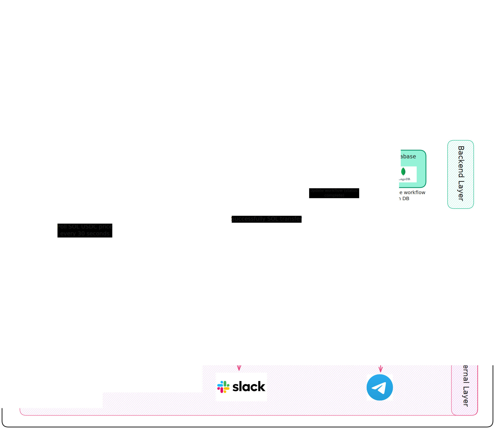

# Decentralised n8n-like Workflow Builder (TBD)

> **Under Development**: This project is currently in active development. Features and APIs are subject to change.

## Vision



A no-code platform built specifically for Solana-based DAOs to automate their operational workflows. It combines the intuitive, drag-and-drop simplicity of tools like n8n with Solana’s high-speed, low-cost blockchain to deliver enforceable, tamper-proof execution - transforming proposals into instant, actionable outcomes.

## Key Features

- **Drag-and-Drop Workflow Builder**: Visual canvas for creating triggers (e.g., new proposal), actions (e.g., escrow funds transfer), and conditions (e.g., vote thresholds) using pre-built nodes designed for the Solana ecosystem.
- **Native Integrations**: Built-in support for major Solana protocols like **Jupiter** (swaps) and **Realms** (governance).
- **On-Chain Escrows and Vaults**: Locks funds in Escrows that auto-release only on verified conditions, ensuring tamper-proof execution.
- **Hybrid Integrations**: Connects off-chain notifications (Slack/email) to on-chain actions with atomic transactions for reliability.
- **DAO Collaboration Tools**: Real-time co-editing, voting, and a unified dashboard for storing logs and transaction signatures.

## Project Structure

### Apps

- `apps/client`: The frontend application (likely Next.js/React).
- `apps/backend`: Backend services for off-chain logic and coordination.

### Packages

- `packages/solana-programs`: Contains the Solana smart programs (Anchor programs).
  - `escrow_logic`: The core program handling escrow logic.
- `packages/workflow-core`: Core workflow definitions and types.
- `packages/workflow-engine`: The engine responsible for executing the defined workflows.
- `packages/common`: Shared utilities and components.

## Getting Started

### Prerequisites

- Node.js
- Yarn
- Rust & Cargo (for Solana programs)
- Solana CLI
- Anchor AVM

### Installation

1.  Clone the repository:
    ```bash
    git clone https://github.com/kabir-fx/n8n-Decentralised.git
    ```
2.  Install dependencies:
    ```bash
    yarn install
    ```

### Development

To start the development server for the applications:

```bash
yarn dev
```
